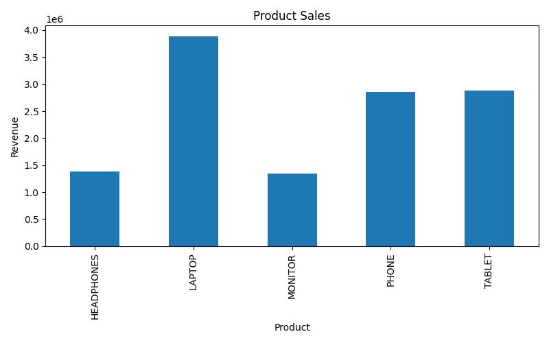
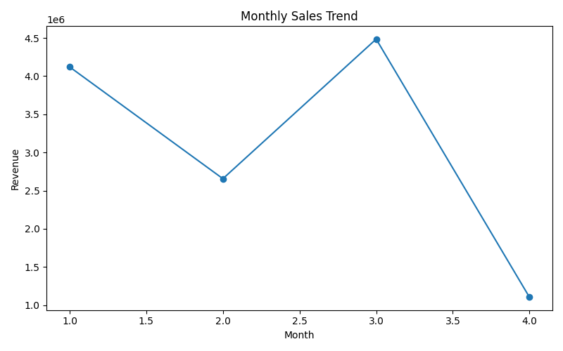
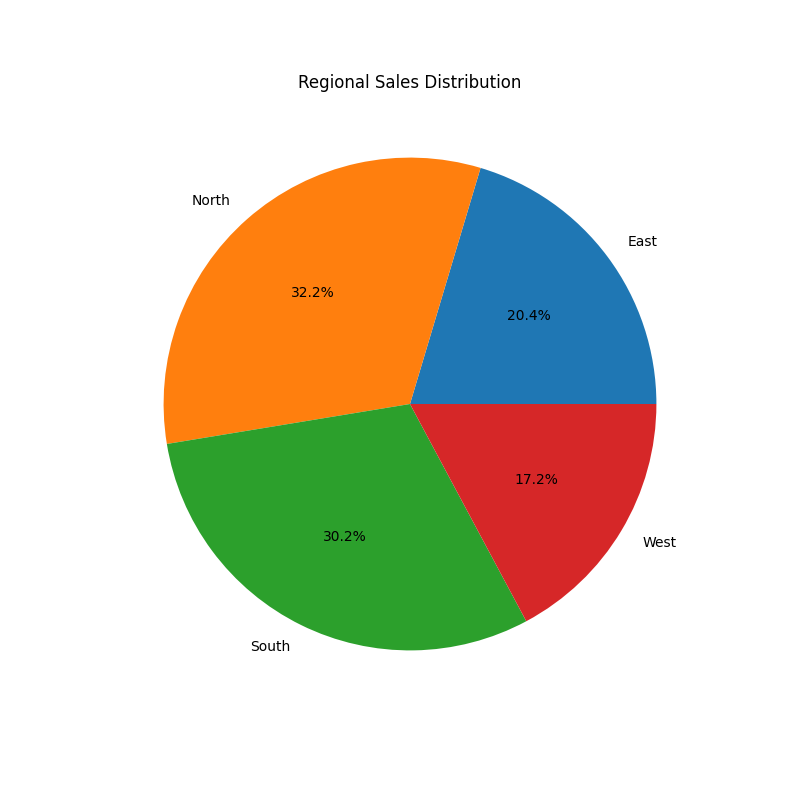
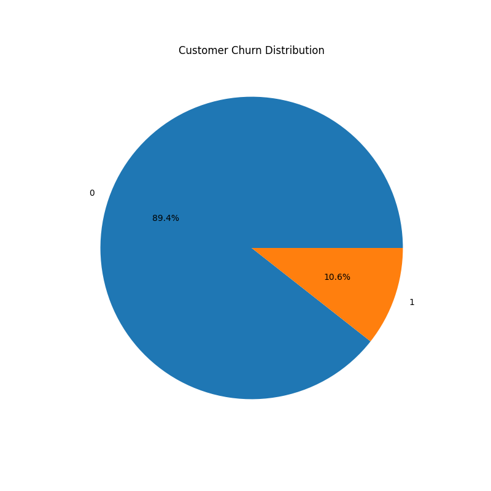

# Customer Sales Analysis Report

## Executive Summary

This report analyzes customer sales and purchasing patterns from the dataset to identify:

- Top-performing customers
- Best-selling products
- Strongest sales regions
- Monthly sales trends
- Customer retention insights

The project also includes data visualizations created using matplotlib and advanced analysis using pandas.

---

# Key Insights & Patterns

-Total Revenue generated: $12,365,048.00

## 1. Product Performance

- The best-selling product is **LAPTOP**
- Total revenue generated: **$3,889,210.00**

- The lowest-performing product is **MONITOR**
- Revenue generated: **$1,348,071.00**

---

## 2. Regional Performance

- The top-performing region is **North**
- Revenue generated: **$3,983,635.00**

This region contributes the highest percentage of total company revenue.

---

## 3. Monthly Sales Trend

- The highest sales month was **3**
- Monthly revenue: **$4,485,006.00**

This indicates a strong sales period during that month.

---

## 4. Customer Analysis

- Total Customers: **100**
- Average Order Value: **$123,650.48**

- Top Customer: **CUST016**
- Customer Revenue: **$373,932.00**

The top customer contributes significantly to overall business revenue.

---

# Charts Generated

The following visualizations were created:

## 1. Product Sales Analysis

This bar chart compares total revenue generated by each product category.

---

## 2. Monthly Sales Trend

This line chart shows how revenue changes across different months.

---

## 3. Regional Sales Distribution

This pie chart shows the revenue contribution from each region.

---

## 4. Customer Churn Distribution

This pie chart visualizes customer retention and churn behavior.

---

# Strategic Recommendations

## Business Recommendations

### 1. Focus on Top-Performing Products

The **LAPTOP** category generated the highest revenue (**$3,889,210.00**), making it the company's strongest product line. Increasing inventory availability, promotional campaigns, and product bundles can further boost revenue.

### 2. Improve Customer Retention Strategies

The top customer (**CUST016**) generated **$373,932.00** in revenue, showing that loyal customers contribute significantly to business growth. Implementing loyalty programs, personalized offers, and customer engagement initiatives can help retain valuable customers and increase repeat purchases.

### 3. Expand Marketing in Strong-Performing Regions

The **North** region generated the highest revenue (**$3,983,635.00**). Investing more in marketing campaigns, regional partnerships, and customer acquisition efforts in this region can maximize sales opportunities and strengthen market presence.

### 4. Improve Performance of Low-Selling Products

The **MONITOR** category generated the lowest revenue (**$1,348,071.00**). Discount offers, product bundles, and targeted promotions may help increase demand and improve sales performance.

### 5. Leverage Monthly Sales Trends

Sales peaked during month **3**, generating **$4,485,006.00** in revenue. Understanding the factors behind this strong performance can help the company replicate successful strategies during slower sales periods.

---

By focusing on high-performing products, retaining valuable customers, and strengthening successful regions, the company can improve overall revenue growth and long-term customer satisfaction.

---

# Conclusion

This project demonstrates:

- Data loading and cleaning
- Data transformation using pandas
- Grouping and aggregation operations
- Data filtering with multiple conditions
- Datetime handling
- Pivot table creation
- Data visualization using matplotlib
- Customer purchasing pattern analysis
- Automated report generation

The project provides a complete intermediate-level Data Science workflow and valuable business insights for decision-making.
